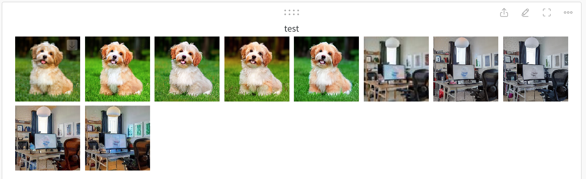

# Training ControlNet tile

Code for training ControlNet tile, adapted from [diffusers controlnet training example](https://github.com/huggingface/diffusers/blob/main/examples/controlnet/train_controlnet.py) by using WebDataset instead of huggingface style dataset specified in that example. Follow the [instructions](https://github.com/huggingface/diffusers/tree/main/examples/controlnet#installing-the-dependencies) for setup.

```bash
MAX_STEPS=10000
LR=1e-5
BS=32
PROMPT_DROPOUT=0.05
OUTPUT_DIR="controlnet/minisd_${BS}_${LR}_${MAX_STEPS}_dropout${PROMPT_DROPOUT}"
MODEL_NAME="lambdalabs/miniSD-diffusers"

accelerate launch --multi_gpu train_controlnet.py \
    --pretrained_model_name_or_path=$MODEL_NAME \
    --output_dir=$OUTPUT_DIR \
    --condition_resolution=64 \
    --resolution=256 \
    --learning_rate=${LR} \
    --max_train_steps=${MAX_STEPS} \
    --max_train_samples=80000000 \
    --dataloader_num_workers=8 \
    --train_shards_path_or_url="/data/laion400m-data/{00000..10200}.tar" \
    --validation_image "./conditioning_image_1.png" "./conditioning_image_2.jpeg" \
    --validation_prompt "a dog sitting on the grass" "home office" \
    --validation_steps=100 \
    --checkpointing_steps=1000 --checkpoints_total_limit=10 \
    --train_batch_size=${BS} \
    --gradient_checkpointing --enable_xformers_memory_efficient_attention \
    --gradient_accumulation_steps=1 \
    --use_8bit_adam \
    --resume_from_checkpoint=latest \
    --mixed_precision="fp16" \
    --tracker_project_name="controlnet" \
    --report_to=wandb \
    --proportion_empty_prompts ${PROMPT_DROPOUT}
```

Above is the exact training script that I used to train a controlnet tile w.r.t. [lambdalabs/miniSD-diffusers](https://huggingface.co/lambdalabs/miniSD-diffusers), a 256x256 SD model. So in my case I was doing 64x64 -> 256x256 upsampling. The key data preprocessing part in the code is at [here](https://github.com/zjysteven/controlnet_tile/blob/d92aa059c3281e81e84b94de17a044e575c5852a/train_controlnet.py#L744-L766), where you could see I was using low-resolution images as conditions and high-resolution images as targets.


I was using laion400m as training data. The training was done on 8x A5000 (24G) GPUs within 5 or 6 hours (with 10k training steps) if I remember correctly. The training essentially worked, which can be seen in the below screenshot. Interestingly, I did observe the ["sudden convergence" phenomenon](https://github.com/lllyasviel/ControlNet/blob/main/docs/train.md#more-consideration-sudden-converge-phenomenon-and-gradient-accumulation) mentioned by the author of ControlNet, where in the first 3k steps the output images didn't follow conditions at all, yet suddenly after that it started to follow the conditions.



For your own case you probably need to change batch size and learning rate. I didn't play with learning rate in my case as `1e-5` just worked.
